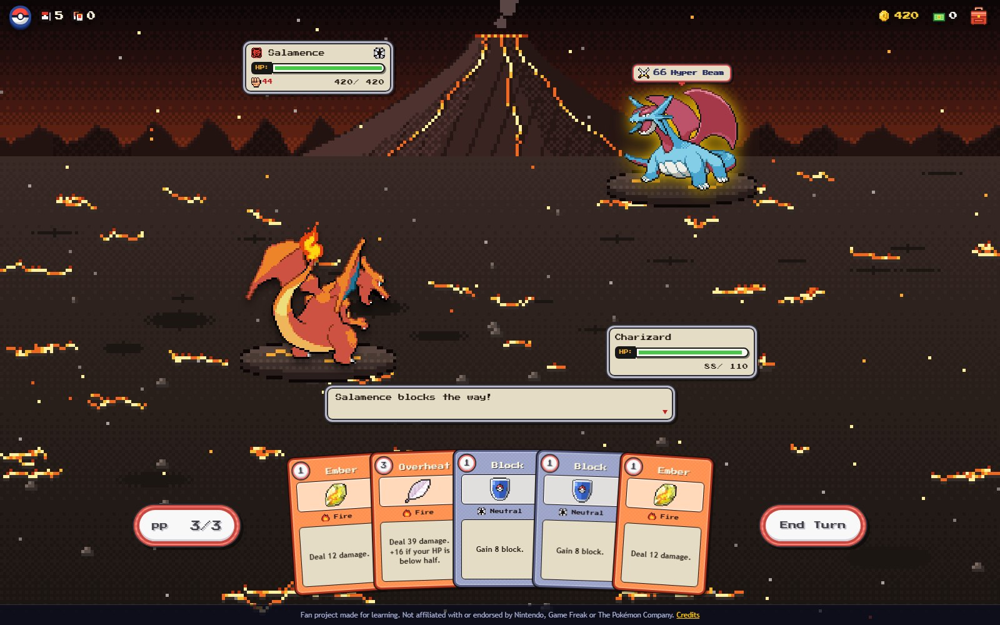
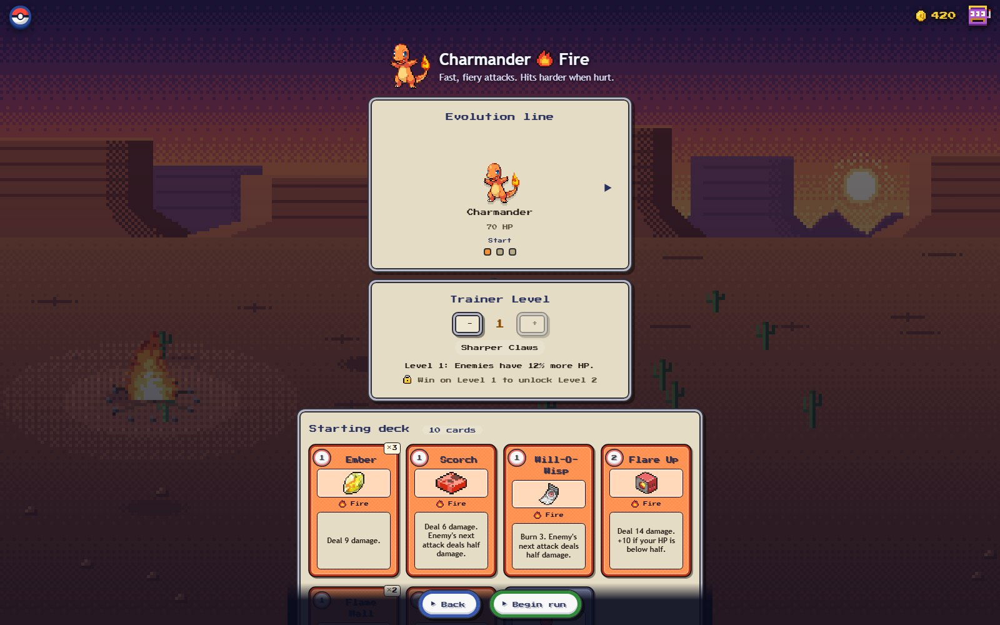
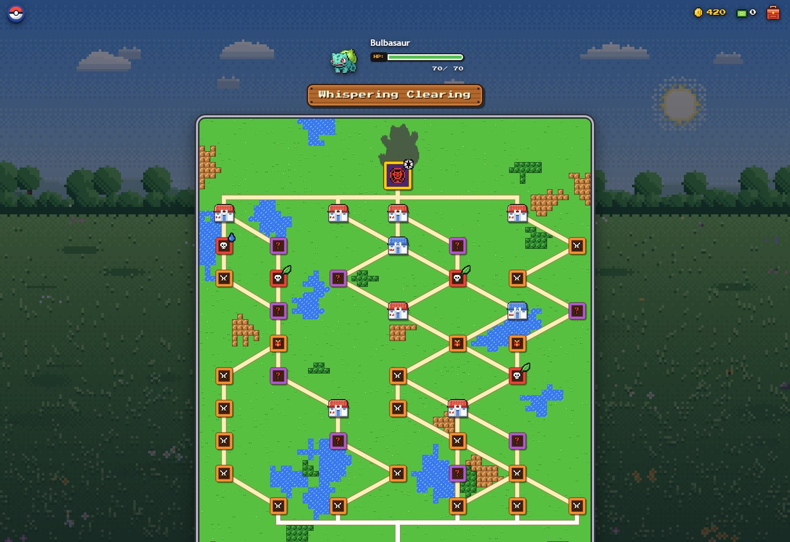
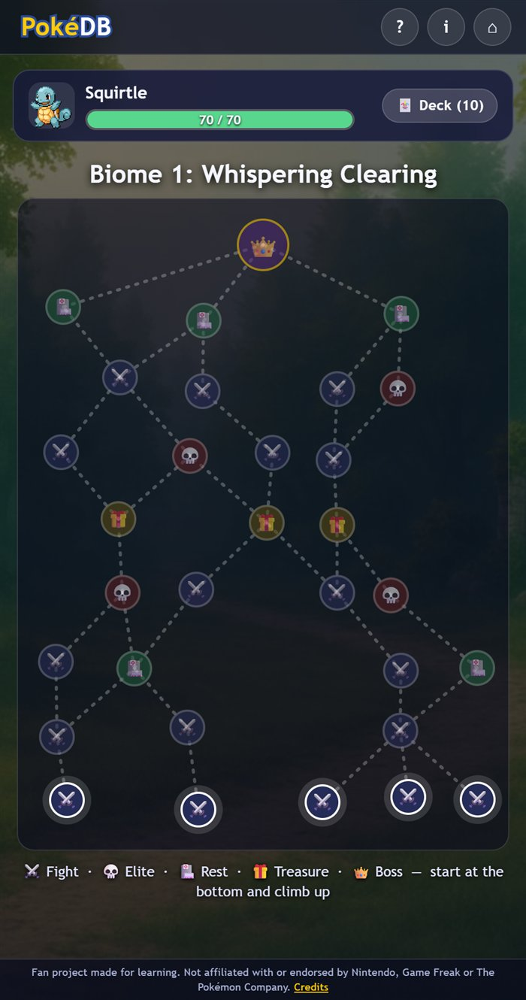
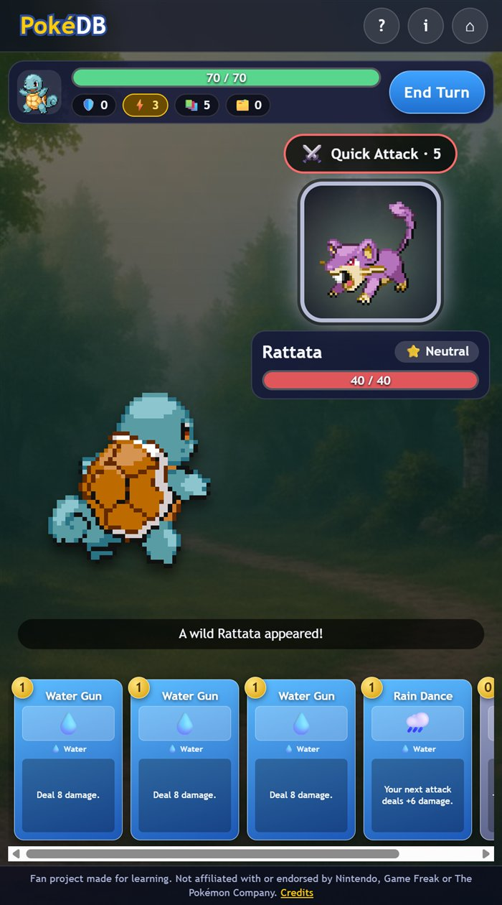

# PokéDB – Rogue-Like Deck Battler

A browser roguelike deck-battler. Pick a starter, climb a branching map, grow your deck with new moves and relics, evolve, and beat three bosses. It is built with plain HTML, CSS and JavaScript, with no frameworks and no build step.

**▶ Play it live: https://patreekare.github.io/pokeDB-3/**



> **Fan project.** PokéDB is a free, non-commercial learning project. It is not affiliated with, endorsed by or sponsored by Nintendo, Creatures Inc., GAME FREAK inc. or The Pokémon Company. See [Credits](#credits-and-legal).

## How to play

1. **Pick a starter.** Charmander, Bulbasaur and Squirtle are free. Six more unlock through achievements. Each starter has its own fixed 10-card deck, which you can preview before you begin. There is no deck editor.
2. **Climb the map.** Start at the bottom and choose a path upward: ⚔️ fights, 💀 elites, 🏥 Pokémon Centers and 🎁 treasure. Your HP carries over between fights.
3. **Battle.** Each turn you draw 5 cards and get 3 ⚡ energy. Tap a card to play it; the number in the gold corner is its cost. The bubble above the enemy shows what it will do next turn.
4. **Grow your deck.** After a fight, pick 1 of 3 new moves. Elites, bosses and treasure give **relics**: held items with permanent bonuses.
5. **Evolve.** Beat the boss of Biome 1 and Biome 2 and your Pokémon evolves: +20 max HP, a full heal, and all moves 25% stronger per stage.
6. **Win the run** by beating the boss of Biome 3. If you faint, the run is over, but your unlocked starters and stats are kept.

**Type chart:** 🔥 Fire beats 🌿 Grass, 🌿 Grass beats 💧 Water, 💧 Water beats 🔥 Fire (×1.5 damage; the reverse is ×0.5). It works both ways: enemy attacks use their own type against you, and a ▲ or ▼ on the enemy's intent shows whether it is strong or weak against your starter. Neutral enemies are always ×1.

**Status effects:** *Block* soaks up damage for one round, *Burn* damages the enemy at the start of its turn, *Focus* powers up your next attack, *Weaken* halves the enemy's next attack, and *Guard* stops it completely.

## Features

- Nine starters (three types), each with its own fixed starting deck and three-stage evolution line.
- A **branching map** for each of three biomes, with fights, elites, rest sites, treasure and a boss. A new map is generated every biome.
- **Card rewards and relics:** 32 cards across common, uncommon and rare rarities, and 11 relics (Charcoal, Leftovers, Focus Sash, Scope Lens…).
- **Turn-based battles** with an energy system, draw and discard piles that reshuffle, enemy intent, type advantages and status effects.
- **Every enemy is a real Pokémon:** 15 wild Pokémon across the three biomes, three elite "Alpha" fights, and the bosses Snorlax, Tangrowth and Salamence, each with its own move pattern.
- **Achievements** unlock the six extra starters, saved in `localStorage`.
- Responsive layout from phones to desktop, keyboard-accessible cards and buttons, and support for `prefers-reduced-motion`.

| Deck preview | Map |
| --- | --- |
|  |  |

| Phone: map | Phone: battle |
| --- | --- |
|  |  |

## Run it locally

The code uses JavaScript modules (`import` / `export`). Browsers block modules on `file://` pages, so serve the folder with any tiny web server:

- **Windows (no install needed):** run `powershell -ExecutionPolicy Bypass -File serve.ps1` in this folder and open <http://localhost:8123>.
- **VS Code:** install the *Live Server* extension, then *Go Live*.
- **Python:** run `python -m http.server` and open <http://localhost:8000>.

There is nothing to install or build.

## How the code is organised

```
index.html            the page: all screens and dialogs
css/
  base.css            colours (CSS variables), buttons, dialogs, bars
  cards.css           how a card looks
  screens.css         layout of every screen
js/
  main.js             start screen and moving between screens
  run.js              one run: the map loop, rewards, evolution, the end
  map.js              building and drawing the branching map
  rewards.js          the "choose one" screen and what you are offered
  battle.js           the turn-based battle (rules on top, drawing below)
  deckpreview.js      the read-only deck preview and deck pop-up
  storage.js          saving and loading with localStorage
  progress.js         unlocking starters through achievements
  ui.js               small shared helpers (dialogs, toasts, cards, relics)
  data/
    cards.js          every card, written as plain data
    starters.js       the nine starters, their decks and evolution lines
    enemies.js        enemies, elites, bosses and the three biomes
    relics.js         held items
    achievements.js   how the locked starters are unlocked
assets/               sprites, backgrounds, enemy art, screenshots
serve.ps1             tiny local web server for Windows
```

### Balancing the game

All the numbers are plain data, so you can tune the game without touching the rules:

- **Cards:** `js/data/cards.js`. For example `{ id: 'ember', name: 'Ember', type: 'fire', cost: 1, art: '🔥', effects: { damage: 8 } }`. The text on the card is generated from `effects`.
- **Starter decks and HP:** `js/data/starters.js` (`deck`, `BASE_HP`, `HP_PER_STAGE`).
- **Enemy HP and damage, and how much harder each biome gets:** `js/data/enemies.js` (`hpMult`, `dmgBonus`, `bossBonus`).
- **How much stronger evolving makes your moves:** `STAGE_POWER` in `js/data/cards.js`.
- **Relics and achievements:** `js/data/relics.js` and `js/data/achievements.js`.

## Credits and legal

- **Pokémon sprites:** Gen 5 pixel art from the [PokeAPI sprites project](https://github.com/PokeAPI/sprites), used for starters, evolutions, and every enemy and boss. The Pokémon and their artwork are © Nintendo / Creatures Inc. / GAME FREAK inc. and are used here on a non-commercial fan-project basis. No affiliation is claimed. If you are a rights holder and want something removed, please open an issue.
- **Backgrounds:** original AI-assisted artwork created for this project. The original monster art (Ashroot, Blazeclaw, Aquaeye) is kept in `assets/enemies/` but is not used in the game right now.
- **Code, card design and game rules:** Patrick ([patreekaRe](https://github.com/patreekaRe)). Rebuilt and restructured with help from Claude Code.
- Emoji are rendered by your device's own emoji font.

## Ideas for later

Catching wild Pokémon, mystery events, a shop, saving a run in progress, more bosses and biomes, and sound effects.
