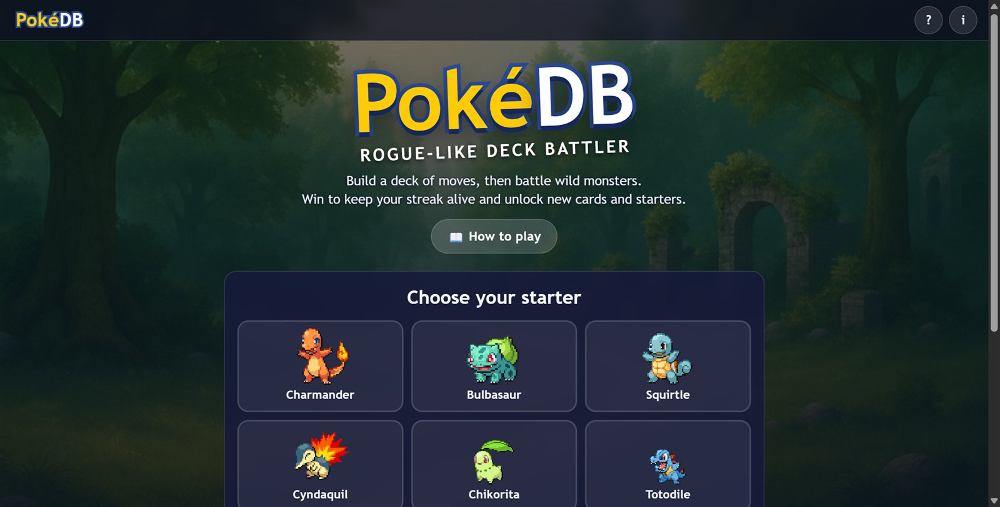
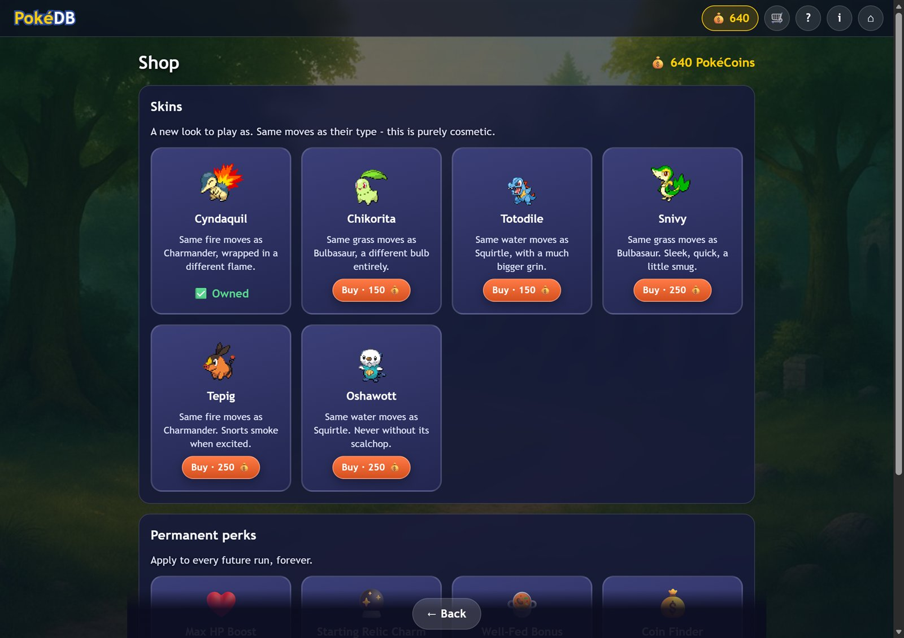

# PokéDB – Rogue-Like Deck Battler

A browser roguelike deck-battler. Pick a starter, climb a branching map, grow your deck with new moves and relics, evolve, and beat three bosses. It is built with plain HTML, CSS and JavaScript, with no frameworks and no build step.

**▶ Play it live: https://patreekare.github.io/pokeDB-3/**


> **Fan project.** PokéDB is a free, non-commercial learning project. It is not affiliated with, endorsed by or sponsored by Nintendo, Creatures Inc., GAME FREAK inc. or The Pokémon Company. See [Credits](#credits-and-legal).

## How to play

1. **Pick a starter.** Charmander, Bulbasaur and Squirtle are free and are the only three with a truly unique deck. Everyone else is a **skin** - same moves as their type, different look - unlocked either in the **🛒 Shop** or through an achievement. Each starter has a fixed 10-card deck, which you can preview before you begin. There is no deck editor.
2. **Climb the map.** Start at the bottom and choose a path upward: ⚔️ fights, 💀 elites, 🏥 Pokémon Centers and 🎁 treasure. Your HP carries over between fights.
3. **Battle.** Each turn you draw 5 cards and get 3 ⚡ energy. Tap a card to play it; the number in the gold corner is its cost. The bubble above the enemy shows what it will do next turn.
4. **Grow your deck.** After a fight, pick 1 of 3 new moves. Elites, bosses and treasure give **relics**: held items with permanent bonuses. Winning fights also earns **PokéCoins** 💰 - more from elites, even more if the elite's type is strong against yours.
5. **Evolve.** Beat the boss of Biome 1 and your starter evolves into its middle form and offers a choose-1-of-2 **mid-tier signature move**. Beat the boss of Biome 2 and it evolves into its final form with a **high-tier** signature move (each type's is a real capstone hit: Blast Burn, Frenzy Plant or Hydro Cannon). Each evolution is +20 max HP, a heal, and all moves 15% stronger.
6. **Win the run** by beating the boss of Biome 3. If you faint, the run is over, but your unlocked starters, PokéCoins and stats are kept.
7. **Go harder.** Every win on your highest **Trainer Level** unlocks the next one (up to Level 5). Each level adds one harder rule on top of the ones before it, from tougher enemies to weaker healing.
8. **Spend PokéCoins in the Shop** (top bar, 🛒) on new skins or permanent perks that apply to every future run - more max HP, a guaranteed starting relic, better healing at Pokémon Centers, or more PokéCoins from every source.

**Enrage:** every 6 turns of a fight, the enemy gains +2 strength, so you can't stall behind block forever.

**Type chart:** 🔥 Fire beats 🌿 Grass, 🌿 Grass beats 💧 Water, 💧 Water beats 🔥 Fire (30% more damage; the reverse does 25% less). It works both ways: enemy attacks use their own type against you, and a ▲ or ▼ on the enemy's intent shows whether it is strong or weak against your starter. Neutral enemies are always ×1.

**Status effects:** *Block* soaks up damage for one round, *Burn* damages the enemy at the start of its turn, *Focus* powers up your next attack, *Weak* makes the enemy deal 25% less damage for a few turns, *Vulnerable* makes it take 50% more from your attacks, and *Guard* stops it completely.

## Features

- **19 starters, 3 of them gameplay-distinct.** Charmander, Bulbasaur and Squirtle each define their type's real deck; the other 15 are skins, 12 later-generation starters (Cyndaquil through Piplup) and one **legendary per type** (Moltres, Virizion, Suicune), all sharing their type's deck and evolution cards. The last is a secret: **Mewtwo**, unlocked by collecting everyone else (its own psychic deck is coming later).
- A **branching map** for each of three biomes, generated the way Slay the Spire does it: random paths that never cross, rooms that only exist where a path went, a treasure floor in the middle, rest sites before the boss, and room rules like "no two rest sites in a row". A new map is generated for every biome.
- **Card rewards and relics:** 32 cards across common, uncommon and rare rarities, and 11 relics (Charcoal, Leftovers, Focus Sash, Scope Lens…).
- **Turn-based battles** with an energy system, draw and discard piles that reshuffle, enemy intent, type advantages and status effects.
- **Every enemy is a real Pokémon:** 15 wild Pokémon across the three biomes, "Alpha" elite fights, and bosses with their own move patterns, one picked at random per run: Snorlax, Arcanine or Poliwrath, then Chandelure, Tangrowth or Ursaring, then Slaking, Magmortar, Gyarados or Salamence. Elites and bosses ignore the type chart, so no starter meets a walled fight.
- **Scouting:** the map picks each elite and boss ahead of time and shows its type as a small badge, so you can route around a matchup you can't win (a Fire starter may want to skip a Water elite).
- **Trainer Levels 0–5** (inspired by Slay the Spire's Ascension): win on your highest level to unlock the next, harder one.
- **Evolution cards in two tiers:** a mid-tier choose-1-of-2 at your first evolution, a high-tier one (each type's canonical capstone move) at your final evolution - a real power spike, not just bigger numbers.
- **PokéCoins and a Shop:** earn coins from fights (a bonus for beating an elite that's strong against your type), then spend them on new skins or permanent perks - more max HP, a starting relic, better rest-site healing, or a coin bonus.
- **Achievements** unlock some skins (mastery-flavoured: a hitless boss, a 50+ damage hit, all three Biome-2 bosses, winning at Trainer Level 5 for the legendaries); others are simply bought in the Shop.
- Responsive layout from phones to desktop, keyboard-accessible cards and buttons, and support for `prefers-reduced-motion`.

| Deck preview | Map |
| --- | --- |
|  |  |

| Phone: map | Phone: battle |
| --- | --- |
|  |  |

| Start screen | Game Corner |
| --- | --- |
|  |  |

## Run it locally

The code uses JavaScript modules (`import` / `export`). Browsers block modules on `file://` pages, so serve the folder with any tiny web server:

- **Windows (no install needed):** run `powershell -ExecutionPolicy Bypass -File serve.ps1` in this folder and open <http://localhost:8123>.
- **VS Code:** install the *Live Server* extension, then *Go Live*.
- **Python:** run `python -m http.server` and open <http://localhost:8000>.

There is nothing to install or build.

## How the code is organised

```
index.html            the page: all screens and dialogs
css/
  base.css            colours (CSS variables), buttons, dialogs, bars
  cards.css           how a card looks
  screens.css         layout of every screen
js/
  main.js             start screen and moving between screens
  run.js              one run: the map loop, rewards, evolution, the end
  map.js              building (Slay the Spire style) and drawing the branching map
  rewards.js          the "choose one" screen and what you are offered
  battle.js           the turn-based battle (rules on top, drawing below)
  deckpreview.js      the read-only deck preview and deck pop-up
  shop.js             the shop screen: buying skins and permanent perks
  storage.js          saving and loading with localStorage (stats, coins, passives)
  progress.js         unlocking starters (free / shop / achievement)
  ui.js               small shared helpers (dialogs, toasts, cards, relics)
  data/
    cards.js          every card, written as plain data
    starters.js       all 18 starters: the 3 real decks and every skin/legendary
    enemies.js        enemies, elites, bosses and the three biomes
    relics.js         held items
    achievements.js   how achievement-locked skins are unlocked
    shop.js           what's for sale and how much it costs
assets/               sprites, backgrounds, enemy art, screenshots
docs/
  archived-starters.md   the old 9-unique-deck design, kept as a restore point
serve.ps1             tiny local web server for Windows
```

### Balancing the game

All the numbers are plain data, so you can tune the game without touching the rules. The default difficulty was tuned with a test bot that plays like a competent player (it blocks big hits, uses type advantage, heals when low, picks sensible rewards). The targets were roughly Slay the Spire's: a normal fight costs about 8–12% of your HP, an elite about 20–30%, and a boss about 20–35%. At Level 0 the bot wins a little over half of its runs (it doesn't scout the map, so a human should do better), and its win rate falls step by step to about 12% at Level 5. Type matchups are deliberately gentle (30% more or 25% less damage, in both directions): at 50% and -50% a good matchup was trivial and a bad one ended runs, which made difficulty depend on luck rather than skill. A human should find Level 0 approachable.

- **Trainer Level rules:** `js/data/difficulty.js`.
- **Enrage:** `ENRAGE_EVERY` and `ENRAGE_BONUS` in `js/battle.js`.
- **Map size and room odds:** the constants at the top of `js/map.js` (`COLS`, `FLOORS`, `PATHS`, `ROOM_ODDS`). More floors means a longer run with more rewards.
- **Cards:** `js/data/cards.js`. For example `{ id: 'ember', name: 'Ember', type: 'fire', cost: 1, art: '🔥', effects: { damage: 8 } }`. The text on the card is generated from `effects`.
- **Starter decks and HP:** `js/data/starters.js` (`deck`, `BASE_HP`, `HP_PER_STAGE`).
- **Enemy HP and damage, and how much harder each biome gets:** `js/data/enemies.js` (`hpMult`, `dmgBonus`, `bossBonus`).
- **How much stronger evolving makes your moves:** `STAGE_POWER` in `js/data/cards.js`.
- **Relics and achievements:** `js/data/relics.js` and `js/data/achievements.js`.
- **PokéCoin rewards and the elite-disadvantage bonus:** `COIN_REWARDS` in `js/run.js`.
- **Shop prices and what perks do:** `js/data/shop.js` (prices) and `js/run.js`/`storage.js` (where each perk actually takes effect - search for `passives`).

## Credits and legal

- **Pokémon sprites:** Gen 5 pixel art from the [PokeAPI sprites project](https://github.com/PokeAPI/sprites), used for starters, evolutions, every enemy and boss, and (for the three legendary skins' final "Ascendant" form) the shiny palette variant from the same set. The animated Black & White style only exists through Gen 5, which is why the roster stops there. The Pokémon and their artwork are © Nintendo / Creatures Inc. / GAME FREAK inc. and are used here on a non-commercial fan-project basis. No affiliation is claimed. If you are a rights holder and want something removed, please open an issue.
- **Backgrounds:** original AI-assisted artwork created for this project. The original monster art (Ashroot, Blazeclaw, Aquaeye) is kept in `assets/enemies/` but is not used in the game right now.
- **Code, card design and game rules:** Patrick ([patreekaRe](https://github.com/patreekaRe)). Rebuilt and restructured with help from Claude Code.
- Emoji are rendered by your device's own emoji font.

## Ideas for later

Catching wild Pokémon, mystery events, saving a run in progress, more bosses and biomes, and sound effects.
