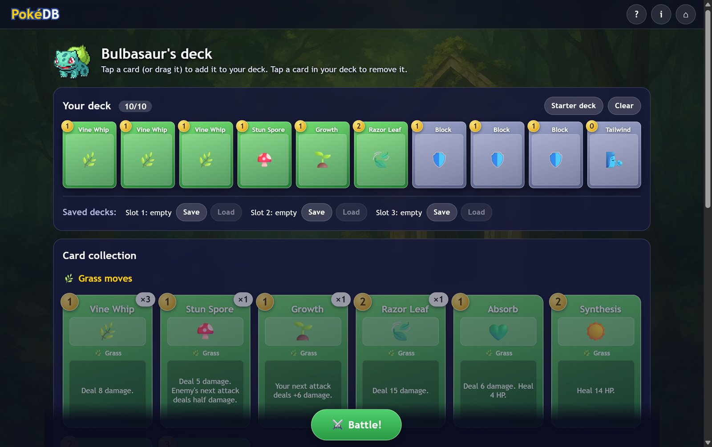

# PokéDB – Rogue-Like Deck Battler

A browser game where you pick a starter, build a deck of move cards, and battle wild monsters turn by turn. It is built with plain HTML, CSS and JavaScript, with no frameworks and no build step.

**▶ Play it live: https://patreekare.github.io/pokeDB-3/**


> **Fan project.** PokéDB is a free, non-commercial learning project. It is not affiliated with, endorsed by or sponsored by Nintendo, Creatures Inc., GAME FREAK inc. or The Pokémon Company. See [Credits](#credits-and-legal).

## How to play

1. **Pick a starter.** Charmander, Bulbasaur and Squirtle are free. The other six unlock as you win.
2. **Build a deck** of 5–10 cards (up to 3 copies of each). Tap a card to add it, or drag it into the deck. Tap a card in your deck to remove it.
3. **Battle.** Each turn you draw 5 cards and get 3 ⚡ energy. Tap a card to play it; the number in the gold corner is its cost.
4. **Read the enemy's intent.** The bubble above the enemy shows what it will do next turn, so you can decide whether to attack or defend.
5. **End your turn.** The enemy acts, then you draw a fresh hand. Reduce the enemy to 0 HP to win.

**Type chart:** 🔥 Fire beats 🌿 Grass, 🌿 Grass beats 💧 Water, 💧 Water beats 🔥 Fire (×1.5 damage; the reverse is ×0.5).

**Status effects:** *Block* soaks up damage for one round, *Burn* damages the enemy at the start of its turn, *Focus* powers up your next attack, *Weaken* halves the enemy's next attack, and *Guard* stops it completely.

## Features

- Nine starters, three types, and 16 cards for each starter's deck (8 type moves + 8 neutral moves). Some cards are locked until you have won enough battles.
- Drag-and-drop **or** tap-to-add deck building, so it works with a mouse and on phones.
- **Saved decks:** your deck is saved automatically for each starter, plus three manual save slots per starter, all in `localStorage`.
- Turn-based battles with an energy system, draw/discard piles that reshuffle, enemy intent, type advantages and status effects.
- Win streaks make the next enemy tougher, and your wins, losses and best streak are saved.
- Responsive layout that works from phones to desktop, keyboard-accessible cards and buttons, and support for `prefers-reduced-motion`.

| Deck builder | Phone |
| --- | --- |
|  |  |

## Run it locally

The code uses JavaScript modules (`import` / `export`). Browsers block modules on `file://` pages, so serve the folder with any tiny web server, for example:

- **VS Code:** install the *Live Server* extension, then *Go Live*, or
- **Python:** run `python -m http.server` in this folder and open <http://localhost:8000>.

There is nothing to install or build.

## How the code is organised

```
index.html            the page: three screens + dialogs
css/
  base.css            colours (CSS variables), buttons, dialogs, bars
  cards.css           how a card looks
  screens.css         layout of the start screen, deck builder and battle
js/
  main.js             start screen and moving between screens
  deckbuilder.js      the deck-building screen
  battle.js           the turn-based battle (rules on top, drawing below)
  storage.js          saving and loading with localStorage
  progress.js         what is unlocked, based on your wins
  ui.js               small shared helpers (dialogs, toasts, the card element)
  data/
    cards.js          every card, written as plain data
    starters.js       the nine starters
    enemies.js        the enemies and their move lists
assets/               sprites, backgrounds, enemy art, screenshots
```

### Adding your own card

Cards are just objects in `js/data/cards.js`. The description text on the card is generated from the effects, so it always matches what the card does:

```js
{ id: 'ember', name: 'Ember', type: 'fire', cost: 1, art: '🔥', effects: { damage: 8 } },
```

Effects you can combine: `damage`, `bonusIfLow`, `block`, `heal`, `draw`, `nextEnergy`, `focus`, `weaken`, `burn`, `guard`, `needsWounded`. Add `unlockAt: 5` to lock a card until 5 total wins.

## Credits and legal

- **Pokémon sprites:** Gen 5 pixel art from the [PokeAPI sprites project](https://github.com/PokeAPI/sprites). The Pokémon and their artwork are © Nintendo / Creatures Inc. / GAME FREAK inc. and are used here under a non-commercial fan-project basis. No affiliation is claimed. If you are a rights holder and want something removed, please open an issue.
- **Enemy monsters (Ashroot, Blazeclaw, Aquaeye) and backgrounds:** original AI-assisted artwork created for this project.
- **Code, card design and game rules:** Patrick ([patreekaRe](https://github.com/patreekaRe)). Rebuilt and restructured with help from Claude Code.
- Emoji are rendered by your device's own emoji font.

## Ideas for later

Relics, boss fights with special patterns, a map of encounters, more starters' unique cards, and sound effects.
